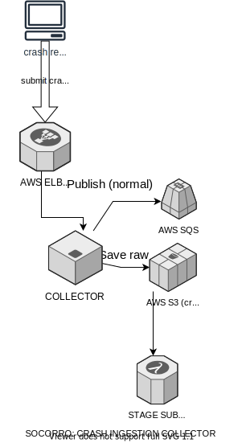

========
Overview
========

.. contents::
   :local:

What is Antenna?
================

Antenna is the name of the collector for the Mozilla crash ingestion pipeline.
The processor, scheduled task runner, and webapp portions of the crash
ingestion pipeline are in `Socorro <https://socorro.readthedocs.io/>`__.

For more information about the crash ingestion pipeline and what the collector
does, see the `Socorro Overview
<https://socorro.readthedocs.io/en/latest/overview.html>`_.

Purpose
=======

Antenna is the collector of the crash ingestion pipeline. It handles incoming
crash reports posted by crash reporter clients, generates a crash id which is
returned to the client, saves the information, and publishes a crash ids for
processing.

Requirements
------------

Antenna is built with the following requirements:

1. **Return a crash id to the client quickly**

   Antenna should return a crash id and close the HTTP connection as quickly as
   possible. This means we need to save to AWS S3 as a separate step.

2. **Try hard not to drop crashes**

   Antenna tries hard not to drop crashes and lose data. It tries to get the
   crash to AWS S3 as quickly as possible so that it's sitting on as few crash
   reports as possible.

3. **Minimal dependencies**

   Every dependency we add is another software cycle we have to track causing us
   to have to update our code when they change.

4. **Make setting it up straight-forward**

   Antenna should be straight-forward to set up. Minimal configuration options.
   Good defaults. Good documentation.

5. **Easy to test**

   Antenna should be built in such a way that it's easy to write tests for.
   Tests that are easy to read and easy to write are easy to verify and this
   will make it likely that the software is higher quality.

High-level architecture
=======================

Antenna is the collector of the crash ingestion pipeline.

Data flow
=========

This is the rough data flow:

1. Crash reporter client submits a crash report via HTTP POST with a
   ``multipart/form-data`` encoded payload.

   See `Specification: Submitting Crash Reports
   <https://socorro.readthedocs.io/en/latest/spec_crashreport.html>`__ for
   details on format.

2. Antenna's ``BreakpadSubmitterResource`` handles the HTTP POST
   request.

   If the payload is compressed, Antenna uncompresses it.

   Antenna extracts the payload.

   Antenna throttles the crash report using a ruleset defined in the throttler.

   If the throttler rejects the crash, collection ends here.

   If the throttler accepts the crash, Antenna generates a crash id.

3. The ``BreakpadSubmitterResource`` adds the crash report data to the
   ``crashmover_queue``.

   At this point, the HTTP POST has been handled, the crash id is sent to the
   crash reporter client and the HTTP connection ends.

   Time passes depending on how many things are in the
   ``crashmover_queue``.

4. A crashmover coroutine frees up, pulls the crash report data out of the
   ``crashmover_queue``, and then tries to save it to crashstorage.

   If crashstorage is ``S3CrashStorage``, then the crashmover saves the crash
   report data to AWS S3.

   If the save is successful, then the crashmover publishes the crash report
   id to the AWS SQS standard queue for processing.

   If publishing is successful, the crashmover moves on to the next crash
   report in the queue.

   If the save or publish is not successful, the crashmover puts the crash
   report data back in the queue and moves on with the next crash.

Diagnostics
===========

Collector-added fields
----------------------

Antenna adds several fields to the raw crash capturing information about
collection:

``collector_notes``
    Notes covering what happened during collection. This includes which fields
    were removed from the raw crash.

``dump_checksums``
    Map of dump name (e.g. ``upload_file_minidump``) to md5 checksum for that
    dump.

``MinidumpSha256Hash``
    The md5 hash of the ``upload_file_minidump`` minidump if there was one.
    Otherwise it's the empty string.

    This is named like this to "match" the equivalent field in the crash ping.

``payload``
    Specifies how the crash annotations were in the crash report. ``multipart``
    means the crash annotations were encoded in ``multipart/form-data`` fields
    and ``json`` means the crash annotations were in a JSON-encoded value in a
    field named ``extra``.

``payload_compressed``
    ``1`` if the payload was compressed and ``0`` if it wasn't.

``submitted_timestamp``
    The timestamp for when this crash report was collected in UTC in
    ``YYYY-MM-DDTHH:MM:SS.SSSSSS`` format.

``uuid``
    The crash id generated for this crash report.

Logs to stdout
--------------

In a production environment, Antenna logs to stdout in `mozlog format
<https://python-dockerflow.readthedocs.io/en/main/logging.html>`_.

You can see crashes being accepted and saved::

    {"Timestamp": 1493998643710555648, "Type": "antenna.breakpad_resource", "Logger": "antenna", "Hostname": "ebf44d051438", "EnvVersion": "2.0", "Severity": 6, "Pid": 15, "Fields": {"host_id": "ebf44d051438", "message": "8e01b4e0-f38f-4b16-bc5a-043971170505: matched by is_firefox_desktop; returned DEFER"}}
    {"Timestamp": 1493998645733482752, "Type": "antenna.breakpad_resource", "Logger": "antenna", "Hostname": "ebf44d051438", "EnvVersion": "2.0", "Severity": 6, "Pid": 15, "Fields": {"host_id": "ebf44d051438", "message": "8e01b4e0-f38f-4b16-bc5a-043971170505 saved"}}

You can see the heartbeat kicking off::

    {"Timestamp": 1493998645532856576, "Type": "antenna.heartbeat", "Logger": "antenna", "Hostname": "ebf44d051438", "EnvVersion": "2.0", "Severity": 7, "Pid": 15, "Fields": {"host_id": "ebf44d051438", "message": "thump"}}

Statsd
------

Antenna sends data to statsd. Read the code for what's available where and what
it means.

Here are some good ones:

* ``breakpad_resource.incoming_crash``

  Counter. Denotes an incoming crash.

* ``throttle.*``

  Counters. Throttle results. Possibilities: ``accept``, ``defer``, ``reject``.

* ``breakpad_resource.save_crash.count``

  Counter. Denotes a crash has been successfully saved.

* ``breakpad_resource.save_queue_size``

  Gauge. Tells you how many things are sitting in the ``crashmover_save_queue``.

  .. Note::

     If this number is > 0, it means that Antenna is having difficulties keeping
     up with incoming crashes.

* ``breakpad_resource.on_post.time``

  Timing. This is the time it took to handle the HTTP POST request.

* ``breakpad_resource.crash_save.time``

  Timing. This is the time it took to save the crash to S3.

* ``breakpad_resource.crash_handling.time``

  Timing. This is the total time the crash was in Antenna-land from receiving
  the crash to saving it to S3.

Sentry
------

Antenna works with `Sentry <https://sentry.io/welcome/>`_ and will send
unhandled startup errors and other unhandled errors to Sentry where you can more
easily see what's going on. You can use the hosted Sentry or run your own Sentry
instance--either will work fine.

AWS S3 file hierarchy
---------------------

If you use the Amazon Web Services S3 crashstorage component, then crashes get
saved in this hierarchy in the bucket:

* ``/v1/raw_crash/<DATE>/<CRASHID>``
* ``/v1/dump_names/<CRASHID>``

And then one or more dumps in directories by dump name:

* ``/v1/<DUMP_NAME>/<CRASHID>``

Note that ``upload_file_minidump`` gets converted to ``dump``.

For example, a crash with id ``00007bd0-2d1c-4865-af09-80bc00170413`` and
two dumps "upload_file_minidump" and "upload_file_minidump_flash1" gets
these files saved::

    v1/raw_crash/20170413/00007bd0-2d1c-4865-af09-80bc00170413

        Raw crash in serialized in JSON.

    v1/dump_names/00007bd0-2d1c-4865-af09-80bc00170413

        Map of dump_name to file name serialized in JSON.

    v1/dump/00007bd0-2d1c-4865-af09-80bc00170413

        upload_file_minidump dump.

    v1/upload_file_minidump_flash1/00007bd0-2d1c-4865-af09-80bc00170413

        upload_file_minidump_flash1 dump.
